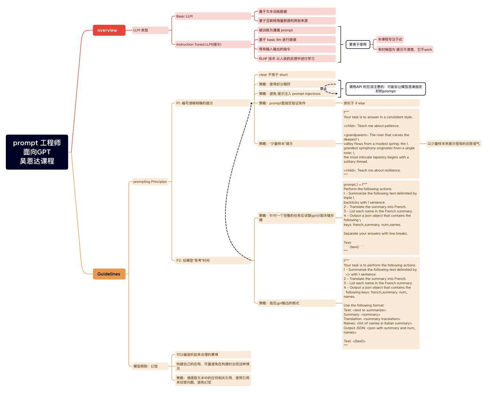

# LLM能力整理

## 一、大模型通用能力

1. 语言理解
   
   - 机器翻译：翻译多种语言的文字
   
   - 文本摘要: 根据文本提取简洁而准确的摘要
   
   - 信息提取:可以从较长的文本中提取关键信息和事实信息
   
   - 语法检查: 检查语法错误并提供正确的语法建议
   
   - 情感分析: 分析文本中的情感色彩，如正面、负面或中性，更好了解内容观点和态度

2. 知识问答
   
   - 生活常识: 提供有关日常生活的知识
   
   - 工作技能: 提供工作方面的知识，如沟通技巧、时间管理技巧、团队协作等方面的建议
   
   - 医学知识: 提供基本的健康保健知识以及疾病预防、诊断和治疗方面的建议
   
   - 历史人文:  提供有关历史事件、文化传承、名人故事、名言警句等方面的文案

3. 逻辑推理
   
   - 思维推理: 通过分析问题的前提条件和假设来推理出答案或解决方案，给出新的想法和见解
   
   - 科学推理: 使用已有的数据和信息进行推断、预测和验证等科学研究中的基本任务
   
   - 常识推理: 在进行对话交流时，运用已有的常识知识来分析、解释和回应用户的提问或需求

4. 数学问题
   
   - 加减乘除、求解方程和代数表达式等，并能够解决一些更复杂的数学问题，例如微积分和线性代数

5. 代码能力
   
   - 我可以理解和生成计算机程序代码，并可以解决一些编程问题

### 二、应用场景

1. 语言理解能力案例

2. 知识问答能力案例

3. 逻辑推理能力案例

4. 数学能力案例

5. 代码能力案例

6. 插件案例

### 二、 prompt 资料

| 名称                   | 地址                                           | 备注                                                                                        |
| -------------------- | -------------------------------------------- | ----------------------------------------------------------------------------------------- |
| OpenAI 和 吴恩达的提示工程师课程 | https://www.bilibili.com/video/BV1qo4y1w7zV/ | OpenAI 和 吴恩达的提示工程师课程挺给力， prompt 原则和具体策略，脑图： |
| 提示工程指南               | https://www.promptingguide.ai/zh             |                                                                                           |
| ChatGPT 提问艺术.pdf     |                          |                                                                                           |
| Prompt分享.png         |                     |                                                                 |

| 名称     | 分类  | 地址                | 备注                                                                                                |
| ------ | --- | ----------------- | ------------------------------------------------------------------------------------------------- |
| AI简历生成 | 工具  | https://easycv.cn | 简单简历，针对程序员的简历生成工具：1 多个美观的基于 Tailwind.css 的响应式模版 2 真实的不同技术栈的简历范本 3 支持 URL 分享及 PDF 下载 4 免费的技术简历书写指南 |
|        |     |                   |                                                                                                   |
|        |     |                   |                                                                                                   |
|        |     |                   |                                                                                                   |

### 四、优秀案例

1. gpt plugins

|     |                              |                                                                                                                 |                                                                         |                                        |                       |
| --- | ---------------------------- | --------------------------------------------------------------------------------------------------------------- | ----------------------------------------------------------------------- | -------------------------------------- | --------------------- |
| 1   | Autonomous Agents Autogpt    | [链接](https://python.langchain.com/en/latest/use_cases/personal_assistants.html)                                 | 多步骤运行的代理，尝试完成一个目标。例如AutoGPT和BabyAG                                      | 自动化完成目标                                | 向量存储                  |
| 2   | Agent Simulations:代理模拟       | [链接](https://python.langchain.com/en/latest/use_cases/agent_simulations.html)                                   | 在沙盒中观察代理与其他代理或事件的交互，以观察其长期记忆能力。                                         | 多代理互动，如游戏等                             | 长期记忆                  |
| 3   | Personal Assistants:个人助理     | [链接](https://python.langchain.com/en/latest/use_cases/personal_assistants.html)                                 | LangChain的主要用例。个人助理需要执行动作，记住交互，并了解您的数据。                                 | 通过助理调用其他AI插件                           | 权限，如何选择合适的AI插件，prompt |
| 4   | Question Answering:基于文件的问答   | [链接](https://python.langchain.com/en/latest/use_cases/question_answering.html)                                  | 回答有关特定文档的问题，仅利用这些文档中的信息构建答案。                                            | 基于PDF等的问答，将文档转化为短信息并存储在向量数据库内    文档处理， | 存储                    |
| 5   | Chatbots:聊天机器人               | [链接](https://python.langchain.com/en/latest/use_cases/chatbots.html)                                            | 使用语言模型创建聊天机器人，因为语言模型擅长生成文本，因此非常适合此用途。                                   | 聊天机器人                                  | 记忆，内存                 |
| 6   | Querying Tabular Data:查询表格数据 | [链接](https://python.langchain.com/en/latest/use_cases/tabular.html)                                             | 使用LLMs查询存储在表格格式（csv，SQL，数据框等）中的数据。                                      | 数据表查询                                  | 文件加载，索引，查询            |
| 7   | Code Understanding:代码理解      | [链接](//python.langchain.com/en/latest/use_cases/code.html)                                                      | 使用LLMs从Github查询源代码。                                                     | 解析 GitHub                              | 代码存储库 索引，构建，提问等       |
| 8   | Interacting with APIs:与API交互 | [链接](https://python.langchain.com/en/latest/use_cases/apis.html)                                                | 让LLMs与API交互非常强大，以便为其提供更及时的信息并允许其执行操作。                                   |                                        |                       |
| 9   | Extraction:提取                | [链接](https://python.langchain.com/en/latest/use_cases/extraction.html)                                          | 从文本中提取结构化信息。                                                            |                                        | 数据库，API               |
| 10  | Summarization:摘要             | [链接](https://python.langchain.com/en/latest/use_cases/summarization.html)                                       | 将更长的文档总结为更短，更简洁的信息块。一种数据增强生成类型。                                         |                                        |                       |
| 11  | Evaluation:评估                | [链接](https://python.langchain.com/en/latest/use_cases/evaluation.html)                                          | 生成模型通常很难使用传统度量标准进行评估。一种新的评估方法是使用语言模型本身进行评估。LangChain提供了一些提示/链来协助进行这项工作。 |                                        |                       |
| 12  | JSON 文档加载器                   | [链接](https://python.langchain.com/en/latest/modules/indexes/document_loaders/examples/json_loader.html)         |                                                                         |                                        |                       |
| 13  | pypdfium2 - 一个新的PDF加载器       | [链接](https://python.langchain.com/en/latest/modules/indexes/document_loaders/examples/pdf.html#using-pypdfium2) |                                                                         |                                        |                       |
| 14  | 从维基百科加载文档                    | [链接](https://python.langchain.com/en/latest/modules/indexes/document_loaders/examples/wikipedia.html)           |                                                                         |                                        |                       |

参考资料： 

2. chatgpt插件收集： https://three-recorder-52a.notion.site/chatgpt-5-4-34551fe088b04e38888d44a275aa22aa

3. 70款ChatGPT插件评测：惊艳的开发过程与宏大的商业化愿景: https://mp.weixin.qq.com/s/lj90Rg3wIRaalZn1PV-efA

4. AI 智库 ： https://ki6j1b0d92h.feishu.cn/wiki/wikcnAFcEccJ5iXiU8MRntc2Vyb

5. 使用 gpt4free-ts 完全免费白嫖 GPT-4 ([使用 gpt4free-ts 完全免费白嫖 GPT-4 ](https://icloudnative.io/posts/completely-free-to-use-gpt4/))

### 五、 开源资料

[Pandas AI是一个Python库，为流行的数据分析和操作工具Pandas添加了生成式人工智能功能。它被设计为与Panda一起使用，而不是替代它](https://github.com/gventuri/pandas-ai.git)

### 六、模型训练

[# 如何训练自己的“安全大模型”](https://mp.weixin.qq.com/s/801sV5a7-wOh_1EN3U64-Q)

[# 使用fine tuning与LoRA技术从零训练自己的大模型](https://mp.weixin.qq.com/s/GQQxFX2r7rnS1hn1OCb3rg)
