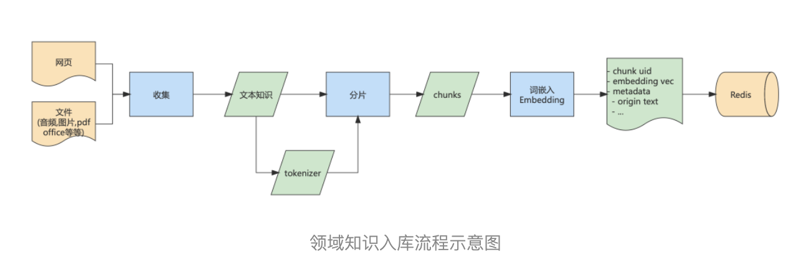

# [如何用大语言模型构建一个知识问答系统](https://aijishu.com/a/1060000000410297)

### Fine-Tuning

[Fine tuning](https://platform.openai.com/docs/guides/fine-tuning) 和 [Embedding](https://platform.openai.com/docs/guides/embeddings)。Fine tuning 又被称为微调，它可以在不改动预训练模型的基础上，对特定任务进一步训练，以适应特定数据和要求。[OpenAI Cookbook](https://github.com/openai/openai-cookbook) 中有一个 [基于 Fine tuning 实现 QA 的例子](https://github.com/openai/openai-cookbook/blob/main/examples/fine-tuned_qa)，不过官方已经不推荐使用这种方式来做知识问答任务，因为 Fine tuning 更适合于学习新任务或新模式，而不是接受新信息，比如我们可以使用 Fine tuning 让模型按特定的语气或风格来回答问题，或者让模型按固定的格式来回答问题。

微调方式比较适合特化的任务或风格，但也存在一些问题：

- 没有解决事实性问答可靠性的问题。
- 消耗的资源量虽然相对大模型预训练减少，但还是不容小觑的。比如 Alpaca 的微调，据作者介绍他们使用 8 个 显存 80GB A100 ，花费了 3 个小时。如果领域支持频繁更新，且需要需要较高的实时性，显然是无法满足要求的。
- 需要构建特定领域微调的训练语料，可以参考Dataset Engineering for LLM finetuning[8]。如果想要获得较好的结果，高质量训练数据集的构建需要精心设计，开销也是不容忽视的。
- 微调的结果不一定符合预期。在 ChatGLM-6B 微调实践中可以发现，使用 ADGEN 数据集微调后，模型对“广告词生成”任务的确变好，但其他任务的回答均不如原始模型。

### 基于 Prompt

将特定领域的知识作为输入消息提供给模型。类似于短期记忆，容量有限但是清晰。举个例子给 ChatGPT 发送请求，将特定的知识放在请求中，让 ChatGPT 对消息中蕴含的知识进行分析，并返回处理结果。

- 优势。正确性和精度高。
- 劣势。一次可以处理的文本量有限制，如果知识库较大，无论从可行性还是效率而言都是不合适的

### 与搜索结合

Fine-Tuning 和基于 Prompt 方式均存在缺陷，比如效率低下、数据不够精确、不能支持大规模数据量等问题。这里提出第三种方法，尝试克服这些困难，基本思想是：

- 使用传统搜索技术构建基础知识库查询。好处在于：
  
  - 问答可控性更高一些
  - 无论是数据规模、查询效率、更新方式都可以满足常见知识库应用场景的需要
  - 技术栈成熟，探索风险低

- 使用 LLM 作为用户和搜索系统件沟通的介质，发挥其强大的自然语言处理能力：对用户请求进行纠错、提取关键点等预处理实现 “理解”；对输出结果在保证正确性的基础上二次加工，比如——概括、分析、推理等。

- LLM。主要功能有以下几点：
  
  - 完成对用户问题的预处理。纠正语法错误，提取关键点，通过交互方式引导用户补充问题足够多的信息等。
  - 对本地搜索系统的原始答案进行二次处理。比如内容过多，可以进行概括；也可以进行简单推理。
  - 提供上下文交互的能力。一个常见的例子是 “**比较**”，比如游戏中贩售道具，倚天剑和屠龙刀。原始知识系统只会提供两件兵器的基础属性，但不会提供各属性的对比和总体评价。提问的过程可以是：
  1. 玩家咨询倚天剑的属性
  2. 玩家咨询屠龙刀的属性
  3. 玩家要求比较倚天剑和屠龙刀。这里 LLM 已经获取两件兵器的属性，使用既有的推理能力进行对比。在同一个会话过程中，可以让 LLM 从会话历史中提取信息并分析。

- 本地搜索系统。解决查询匹配的问题，在Search: Query Matching via Lexical, Graph, and Embedding Methods[10] 一文中介绍了三种基本方式：
  
  - Lexical-based search。通过归一化、拼写纠错、扩展、翻译等方式对查询请求中的词进行替换。性能好、可控性强，尽管存在一些语义鸿沟问题，但仍被广泛的应用在现有的搜索引擎架构中。
  - Graph-based search。以图的形式描述知识点以及相互间的关系，然后通过图搜索算法寻找与查询请求匹配的结果。
  - Embedding-based search。将文字形式的查询请求，编码为数值向量的形式，体现潜在的关系。该文[11]介绍了 Word Embedding 的一些技术实现

## 方案实现

本文的实现，参考了 OpenAI 提供的样例，主要理由是 ChatGPT 对外提供了良好的 API 以及中英文支持。但从框架角度而言，不会绑死在 OpenAI 上，每一个具体实现都可以由业务结合自己的需求进行替换。上节提到的方案落地到 ChatGPT 上特化为

说明如下：

1. 使用 OpenAI 的 Embedding 接口将专业领域知识转化为向量，连同原始材料一并保存在 Redis 中。
2. 用户提问的搜索处理：
3. 使用 OpenAI API 对用户的问题进行 Embedding，获得向量。
4. 使用问题向量在 Redis 中搜索，找到与之最匹配的若干记录。将这些记录的原始材料返回。
5. 使用 OpenAI 的 Completion API 对这些原始材料进行加工完善，并将最终结果返回。

### 领域知识入库

该过程的主要目的是：将原始知识库分拆为若干知识点，并生成与之对应的字典：

- key 是知识点 Embedding 之后生成的向量
- value 是知识点的原始记录

该字典的作用是用户提问时，通过 Embedding 之后的向量比对，实现问题和答案的匹配。具体过程涉及以下几点，如图所示：

1. 数据源可能来自于网络（游戏已经对外的攻略）、本地文本文件（技术文档、设计稿）或者数据库（业务自己维护的 UGC，比如用户帖子、评论等）。采用合适的方式收集这些数据并整理为纯文本的格式。这里提供一个 python 库textract[12]，支持从多种类型文件中提取文字信息，普通文本文件自不必说，其它各种常用格式文件也都支持，比如：Microsoft 全家桶 docx, xlsx；图像 gif, jpg 等；音频文件 mp3, ogg 等。

2. 生成分词器 tokenizer，将文本分成一个个词元，保证各个词元拥有相对完整和独立的语义，以供后续任务比如 Embedding 使用。tiktoken[13]是一种 Byte Pair Encoding(BPE)[14] 分词器，有多种编码方法可选，如：r50k\_base, p50k\_base, cl100k\_base 等。面向 OpenAI 的 gpt-4, gpt-3.5-turbo 和 text-embedding-ada-002 模型通常使用 cl100k\_base 编码方法。

3. 分片。将原始知识库拆分为若干个独立、较短的知识点。每个知识点会作为问答的最小记录，与问题进行匹配。在实际使用过程中有以下几点建议：
   
   - 原始内容在编写、组织时最好原子化、正交化。对于树状结构的知识点，可以按层级关系表示，最好不要混为一谈。比如倚天剑可能基础属性，也有适合的打法，偏向的英雄天赋，那么三者应该独立描述，而不要混杂在一起。
   - 可以在原始语料中设计明确的分片标记，简化处理过程。对于 html、markdown 等类型的文档而言，天然结构化处理会简单一些。
   - 基本的分片方式。粒度从细到粗可以使用，标点符号、段落、章节等进行区分。分片粒度过细，知识点会比较零碎影响了相互间的关系；分片粒度过粗，在匹配时可能会携带冗余信息，另外对 Embedding、处理、索引的效率也有影响。
   - 分片要使用 tokenizer，原始文本经过分词然后再进行 embedding，分片大小需要考虑分词之后生成的 token 数量。基本目标是：分片不能破坏知识点的完整性，生成的分片对应的 token 数量应该在预设范围内，不要过小或过大。

4. 词嵌入(Embedding)。使用 OpenAI API 对每个分片后的每个知识点进行处理，获得向量化的结果。这里需要调用 `openai.Embedding.create` 接口。

5. 存储。将 Embeddings 生成的向量连同原始分片（知识点），以 kv 形式存储，便于后续快速匹配索引。专业的解决方案是 vector database[15]，但实际上很多传统的数据库或存储中间件也已经提供了支持，比如：
   
   - RediSearch 提供的 Vector Similarity[16] ，支持使用向量字段和向量相似性查询。它可以加载、索引和查询存储在 Redis 哈希或 JSON 文档（通过与 RedisJSON 模块集成）中的向量。Vector Similarity 提供了实时向量索引、实时向量更新/删除、K-最近邻（KNN）搜索和范围过滤等功能。
   - pgvector[17]基于 PostgresQL，提供了类似的向量索引支持。和 Redis 的基本功能差不多，在向量距离计算方面，也提供了：L2、点积和 COSINE 这三种方法。使用 Redis 比较简单高效，接口和文档非常丰富，如果没有特别要求可以直接使用。
   
   ### 搜索
   
   搜索的核心流程包含两步：
   
   1. 将用户的问题通过 OpenAI API `openai.Embedding.create`进行 embedding 得到向量。
   2. 向 redis 发起查询获得与之最匹配（距离最近、相似度最高）的若干答案。
   
   除此外，也可以利用 LLM 对用户的问题进行预处理，常见的方式有：
   
   - 简化概括用户的问题
   - 利用思维链(Chain-Of-Thought, COT)提示的能力，提供范本，让 LLM 按样例和用户进行交互，将问题逐步完善，直到获取足够的信息为止。以游戏 NBA2K 为例，球员的打法在不同比赛模式中是不同的，比如王朝 5v5 和街头 3v3 就不一样。用户可能并未意识到这一点，希望 LLM 能够自动和玩家交互直到获得：问题和比赛模式两个信息，再进行处理。细节可以参考知乎的文章ChatGPT 系列教程—提问篇：Prompt 的高级概念[18]，本文不再赘述。这里仅提供一个示例，告知 ChatGPT 使用案例中的样式和玩家交互：
   
   > 你是一个游戏客服。你需要在和用户的交流过称中提取一个问题和比赛模式这两个信息。请按照下面的方式一步步思考：- 玩家问了一个问题 - 如果问题中没有包含比赛模式，你需要请他提供比赛模式信息，比如可以问他：你指的是哪一种比赛模式？- 一旦你获得了比赛模式，那么说：好的，开始为您查找。例子：User：请问科比的打法是什么？Assistant：你指的是哪一种比赛模式？User: 王朝模式 Assistant: 好的，开始为您查找。
   
   
   
   对于 ChatGPT 而言，上述这种预设对话行为来引导用户的方式称之为 `ChatCompletion`，可以 `openai.ChatCompletion.create` api，将多轮会话的上下文整合起来，对提问和回答过程提供更加强大、灵活的定制能力。比如：
   
   - 要求用户的提问必须提供足够的指定类型的信息。
   - 为用户提供的多轮信息进行进行总结。
   
   交互式会话中， 提供了三种不同的角色(role)：user，system，assistant。
   
   - user 代表用户，记录用户的提问
   - system 用于向 chatgpt 发出指令，定义其应答行为
   - assistant 代表 chatgpt 返回的结果
   
   具体可以参考 ChatGPT API Transition Guide | OpenAI Help Center[19]
   
   ### 结果整合
   
   结果整合的主要作用是将本地搜索系统返回的结果进行二次加工，比如发挥 LLM 的：
   
   - 总结、概括
   - 格式整理
   - 去重、翻译
   - 从会话历史中，提取上下文，进行分析处理等能力
   
   实现的方法还是基于 `ChatCompletion` ，方式很多，业务完全可以结合场景自由发挥。这里提供一个在 NBA2K Online2 中实现的方式：
   
   
   
   - 首先交互式提问完成后，对会话历史进行总结，让 ChatGPT 用一句话概括，须包含问题和赛季信息。
   
   - 基于该问题，进行 Embedding 并在本地搜索，搜索的结果可能有多条，也可能没找到。如果找不到则返回特殊语言标记，比如：本地知识库找不到。
   
   - 以 ChatCompletion 的方式和 OpenAI 交互，让 ChatGPT 基于本地搜索结果和历史会话，进行总结整理。需要以 system 的身份，注入 Prompt 定义 ChatGPT 的应答行为。具体方法是：
     
     1. 本地 search result 有效，可能有多条最贴近的知识点，则整理总结作为最终结果。
     2. 本地 search result 返回特殊标记，比如：本地知识库找不到，则基于 conversation history 分析；如果还是找不到则提示找不到。
     3. 基于用户的请求 user\_query 触发本地搜索，获得答案 search result
     4. 将答案以 system role 的身份插入 conversation history 中，要求对于用户发出的请求 user\_query 使用 search result 回复
     5. 将包含本地搜索答案的 system 指令和用户问题依次推入 conversation history
     6. 交给 chatgpt 的 ChatCompletion 处理：
   
   - 另外一个比较特殊的情况是，本地搜索的结果不满足要求比如相似度过低，那么尝试基于会话历史让 chatgpt 进行处理。
   
   ## 应用效果
   
   上述方案在测试过程中，以 NBA2K Online2 官网的攻略信息[20]为基础进行尝试，基于 OpenAI API，搭建简单的 CLI 的应用。效果如下所示（为了简化过程，一律省略多轮交互问答的过程）。
   
   #### 基础能力
   
   对问题在本地进行搜索，找到多条匹配语料，然后自动整合使用无序列表的形式返回。
   
   - 问题：关于詹姆斯的打法。
   - 本地 Redis 搜索命中的关联度最大的若干条答案：  
     
   - 整合后的反馈：
   
   
   
   ### 基于会话历史的问答
   
   知识库中仅保存了：奥拉朱旺、科比、詹姆斯三人各自的打法信息，并没有直接提供三者的比较。所以如果仅通过一个问题要求比较三人的打法差异，是无法在 Redis 中直接匹配命中的。但是可以使用会话历史，当本地无法命中时，让 ChatGPT 基于过往的信息自动进行整合，如下所示：
   
   
   
   ## 总结
   
   本文针对特定领域知识问答系统的问题，进行方案比较和选型。不难发现：传统的搜索模式、LLM 的 Fine-Tuning、Prompt Engineer 等方式均存在不同程度的缺陷。经过分析比较后，决定探索 **LLM +搜索** 的方式进行处理，并在 NBA2K Online2 攻略应用场景进行验证。该方法：
   
   - 将本地知识通过传统搜索框架进行处理，并作为答案的基础数据源。这保证了答案的精准和可靠。
   - 同时基于 Prompt Engineering 激发 LLM 的自然语言理解、生成和简单推理能力，对用户的问题预处理、对原始答案进行加工。从而提供了更加智能和友好的交互方式。
   
   在实践过程中，选择 ChatGPT 作为 LLM 的经典实现，使用 RediSearch 提供的 Vector Similarity 作为问题答案的匹配索引框架。但 LLM+搜索的方式在框架上是非常通用的，不局限于上述选择，业务完全可以基于自身场景使用其他基础模型和搜索方案。另外业务在和 LLM 交互过程中也可以定制更加灵活、智能的提示词来引导交互过程。本文的细节实践仅供参考，希望可以起到抛砖引玉的效果。
   
   
   
   https://mp.weixin.qq.com/s/movaNCWjJGBaes6KxhpYpg
   
   ### 参考资料
   
   [1]似是而非或无意义: *[https://www.entrepreneur.com/...](https://aijishu.com/link?target=https%3A%2F%2Fwww.entrepreneur.com%2Fgrowth-strategies%2Fthe-advantages-and-disadvantages-of-chatgpt%2F450268)*
   
   [2]大语言模型（Large Language Model, LLM）: *[https://research.aimultiple.c...](https://aijishu.com/link?target=https%3A%2F%2Fresearch.aimultiple.com%2Flarge-language-models%2F)*
   
   [3]Foundation Model: *[https://en.wikipedia.org/wiki...](https://aijishu.com/link?target=https%3A%2F%2Fen.wikipedia.org%2Fwiki%2FFoundation)\_models*
   
   [4]Prompt Engineering: *[https://www.allabtai.com/prom...](https://aijishu.com/link?target=https%3A%2F%2Fwww.allabtai.com%2Fprompt-engineering-tips-zero-one-and-few-shot-prompting%2F)*
   
   [5]ChatGLM: *[https://github.com/THUDM/Chat...](https://aijishu.com/link?target=https%3A%2F%2Fgithub.com%2FTHUDM%2FChatGLM-6B)*
   
   [6]Alpaca: *[https://github.com/tatsu-lab/...](https://aijishu.com/link?target=https%3A%2F%2Fgithub.com%2Ftatsu-lab%2Fstanford)\_alpaca*
   
   [7]扩充中文词表的开源方案: *[https://link.juejin.cn/?targe...](https://aijishu.com/link?target=https%3A%2F%2Flink.juejin.cn%2F%3Ftarget%3Dhttps%3A%2F%2Farxiv.org%2Fpdf%2F2304.08177v1.pdf)*
   
   [8]Dataset Engineering for LLM finetuning: *[https://www.flowrite.com/blog...](https://aijishu.com/link?target=https%3A%2F%2Fwww.flowrite.com%2Fblog%2Fdataset-engineering-llm-finetuning)*
   
   [9]Chatgpt 的限制: *[https://github.com/openai/ope...](https://aijishu.com/link?target=https%3A%2F%2Fgithub.com%2Fopenai%2Fopenai-cookbook%2Fblob%2Fmain%2Fexamples%2FQuestion)\_answering\_using\_embeddings.ipynb?spm=wolai.workspace.0.0.357e11a2XSQ9wO&file=Question\_answering\_using\_embeddings.ipynb*
   
   [10]Search: Query Matching via Lexical, Graph, and Embedding Methods: *[https://eugeneyan.com/writing...](https://aijishu.com/link?target=https%3A%2F%2Feugeneyan.com%2Fwriting%2Fsearch-query-matching%2F)*
   
   [11]该文: *[https://medium.com/intelligen...](https://aijishu.com/link?target=https%3A%2F%2Fmedium.com%2Fintelligentmachines%2Fword-embedding-and-one-hot-encoding-ad17b4bbe111)*
   
   [12]textract: *[https://textract.readthedocs....](https://aijishu.com/link?target=https%3A%2F%2Ftextract.readthedocs.io%2Fen%2Fstable%2F)*
   
   [13]tiktoken: *[https://github.com/openai/tik...](https://aijishu.com/link?target=https%3A%2F%2Fgithub.com%2Fopenai%2Ftiktoken)*
   
   [14]Byte Pair Encoding(BPE): *[https://en.wikipedia.org/wiki...](https://aijishu.com/link?target=https%3A%2F%2Fen.wikipedia.org%2Fwiki%2FByte)\_pair\_encoding*
   
   [15]vector database: *[https://learn.microsoft.com/e...](https://aijishu.com/link?target=https%3A%2F%2Flearn.microsoft.com%2Fen-us%2Fsemantic-kernel%2Fconcepts-ai%2Fvectordb)*
   
   [16]Vector Similarity: *[https://redis.io/docs/stack/s...](https://aijishu.com/link?target=https%3A%2F%2Fredis.io%2Fdocs%2Fstack%2Fsearch%2Freference%2Fvectors%2F)*
   
   [17]pgvector: *[https://github.com/pgvector/p...](https://aijishu.com/link?target=https%3A%2F%2Fgithub.com%2Fpgvector%2Fpgvector)*
   
   [18]ChatGPT 系列教程—提问篇：Prompt 的高级概念: *[https://zhuanlan.zhihu.com/p/...](https://aijishu.com/link?target=https%3A%2F%2Fzhuanlan.zhihu.com%2Fp%2F623395924)*
   
   [19]ChatGPT API Transition Guide | OpenAI Help Center: *[https://www.wolai.com/9fBmz1E...](https://aijishu.com/link?target=https%3A%2F%2Fwww.wolai.com%2F9fBmz1E4WZWbHJZQYKHTji.md)*
   
   [20]攻略信息: *[https://nba2k2.qq.com/act/a20...](https://aijishu.com/link?target=https%3A%2F%2Fnba2k2.qq.com%2Fact%2Fa20200520apph5%2Fapp%2Findex.html%23%2Fol2%2Fnews%2F6366)*
