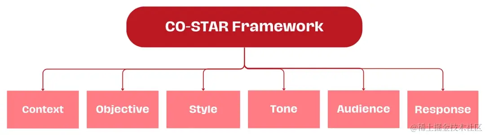

## prompt 整理

#### CO-STAR 框架

其工作原理如下：

（C）Context：提供任务的背景信息
有助于 LLM 理解正在讨论的具体语境，确保其回答是相关的。

（O）Objective：确定希望 LLM 执行的任务是什么
明确目标任务有助于 LLM 将其回答重点放在实现某一特定任务上。

（S）Style：指明希望 LLM 使用的写作风格
可以设置为某位著名人物的写作风格，也可以是某个专业领域的专家，比如商业分析专家或首席执行官。这样能够引导 LLM 以符合用户需求的方式和用词做出回答。

（T）Tone：需要确定大模型回答用户提示词的态度
这样可确保 LLM 的回答与所需的情感或语境相呼应。例如，正式、幽默、感同身受等。

（A）Audienc：确定回答的对象
根据回答对象的身份（如某一领域的专家、初学者、儿童等）量身定制 LLM 的回答，确保其在所需的语境中是恰当和可以理解的。

（R）Response：提供 LLM 回答的格式
该功能可以让 LLM  以下游任务所需的准确格式输出。例如，列表、JSON（JavaScript Object Notation）、专业报告等。对于大多数以编程方式在下游操作 LLM 回答的 LLM 应用程序来说，JSON输出格式是最理想的。

### 将特殊字符作为分隔符

### 将 XML 标签作为分隔符