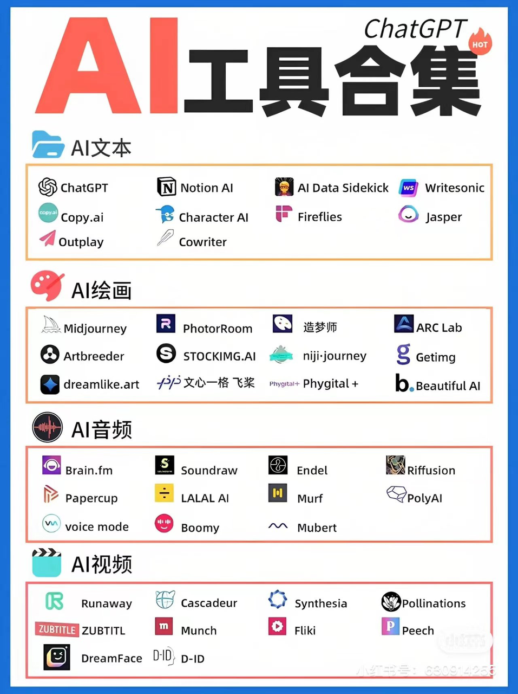

# AI工具

https://civitai.com/

Writesonic：人工智能写作辅助工具​

copy.ai：使用 AI 编写更好的营销文案和内容​

Character.AI：AI 人工交互​

Fireflies：该工具可插入 Zoom、Teams 或 Webex 等流行的视频会议工具，并自动执行做笔记和创建转录的过程​

Jasper： AI 文案写作工具​

CoWriter：AI 辅助写作​

Midjourney：AI 绘画神器​

PhotoRoom：擦除任何背景、对象​

造梦师：只需一句话，让你的文字变成画作​

ARC Lab：一款提供照片修复、抠图、画质增强的在线工具​

Artbreeder：人工智能合成创意工具​

Stockimg AI：生成各种各样的设计元素, 包括 logo、插画、图片壁纸等​

niji·journey：二次元 ai 绘画​

Getimg.ai：关键词生成图片的 AI 工具​

Dreamlike.art：AI 图像生成​

文心一格 飞桨：AI 艺术和创意辅助平台​

Phygital+：AI 图像生成​

Beautiful.ai：AI 生成 PPT​

Brain.fm：专注、放松、冥想和睡眠，聆听为您的大脑量身打造的音乐​

Soundraw：人工智障生成音乐​

Endel：个性化背景音，帮助您集中注意力、放松和睡眠​

Riffusion：实时音乐和音频生成库​

Papercup：人工智障配音和视频翻译软件​

LALAL.AI：从任何音频和视频中提取人声、伴奏和各种乐器​

Murf：使用多功能 AI 语音生成器从文本到语音​

PolyAI：语音助手​

Voicemod：语音实时变声器​

Boomy：人工智障生成音乐​

Mubert：人工智障生成音乐​

Runway： AI 魔法工具​

Cascadeur：人工智障辅助关键帧动画软件​

Synthesia：人工智障视频生成​

Pollinations：文本转视频、图片​

Zubtitle：为视频添加字幕和在线编辑视频​

Munch：人工智障提取视频中的最引人入胜、最流行和最有影响力的片段​

Fliki：将文本变成带有 AI 语音的视频​

Peech：个性化的自动视频编辑和管理平台​

DreamFace：AI 动画照片应用程序​

D-ID：人工智障视频生成​

优秀工具集组合

> 创意工具集（AI Tools Store），里面有100 多种人工智能工具 : https://www.vondy.com/?via=mooney
