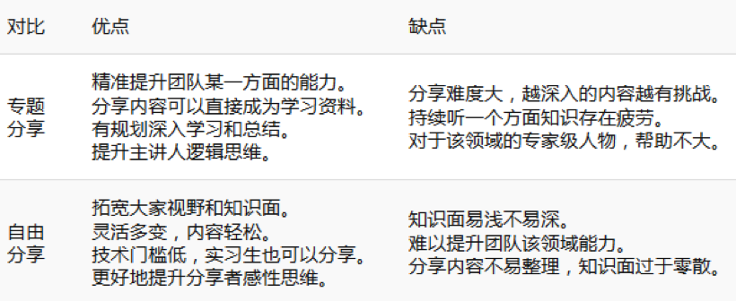

# 技术分享方案

### 1.为什么要技术分享

- ##### 对个人而言

•从个人成长的角度：越分享，收获越多，学习新知识，完善自我体系

•通过分享，让别人也能感受到与自己相同的快乐

•提高个人的竞争力

- ##### 对团队而言

•提高研发效率和代码的健壮性

•提供团队的技术能力和竞争力

•提高团队的技术知识储备（每次录音+ppt）

### 2.如何做技术分享

- 技术分享-容易存在的问题1

很多公司技术分享都难以长期推进，甚至最终不了了之，难道我们大家缺少分享精神么？

我相信自私只能是少数人，更多的人还是乐于分享和帮助他人的，大家都不去分享，很可

能是我们的技术分享平台本身存在问题，技术分享难以持续的原因

1. 内容简单，会失去兴趣

2. 时间仓促，会导致质量不高

3. 频率较低，会难以深入去实施

4. 选题随意，会达不到较高的成果产出

5. 责任平摊，会降低执行力

6. 单纯开会，会阻碍实质性成长总结
- 技术分享中存在的问题2
  
  技术分享存在的一些问题
  
  1. 后端分享，我听不太明白，和我没有太大关系，我是否可以不参加，反之，分享的是前端，我后端就不参加了？
  
        解决方案：如果确实不愿意了解，确实和自己内容差别比较大，可以不参加，但是从另外角度上，语言就是一种解决问题的工具，希望大家也能多方面了解和学习，说不定哪天就用上了呢，可以学下其他语言设计和架构
  
  2. 我这几周比较忙，没有时间准备。
  
        解决方案：如果确实比较忙，可以和负责人调完时间，但是至少要提前一周告知，方便其他人提前准备
  
  3. 因为大家水平不一致，别人分享的我都了解，太简单了，我就不参加或者玩手机吧
  
        解决方案：如果你参加了，来了，希望大家都能够尊重的态度听完，再小的内容也有技术盲点。 相信大家都有收获
  
  4. 有些人习惯懒散，技术分享的准备会一直拖着，就算有人提醒和催促，也经常是在临近时间节点时候才想起来做。做的ppt，就算内容能讲一个小时，质量也会很差，讲的过程中磕磕绊绊
  
         解决方案：分享人提前两周开始准备技术分享，并在分享前一周，把技术分享大纲、或者ppt内容轮廓做完，并邮件发给所有人分享的内容目录，提前一周准备了，肯定有所避免这种现象
  
  5. 他讲的技术我不太了解，听不懂，听不下去，基本没有收获
  
          解决方案：因为已经提前一周发出来分享内容了，没听过的技术点，希望大家提前去上网查一些资料，带着自己的理解、问题去听，效果会非常非常好！ 听完分 享会，可以巩固现有的知识体系，正视之前过于浅显的理解，纠正细微的认知误区，解决困扰自己的问题，等等。只有自己准备了，才会有如此多的收获，想想何乐
  而不为呢！
  
  6. 因为有人总是提出一些小白问题，好烦，分享进度好慢
     
           解决方案：呵呵，因为每个人技术水平不一样，这是一个大家能一起成长的平台，说不定别人提到的正好你也不了解呢？大家要互相包容，<mark> 但是但是</mark>，不要因为自己就没有提前看别人的分享的内容，再提出小白问题，这是严令禁止的

- 如何做技术分享
  
  四规则、四要求
  
  1. 明确负责人
     
     •顺序轮流分享模式，避免无责任，大家都不主动分享，和自己无关，避免出现“反正不是我一个人的事，不需要我主动推进”，“我都分享2次，你一次还没有分享呢！”
  
  2. 专题分享（占比80%）+自由分享（占比20%）
     
     •为什么采取这种模式：专题分享和自由分享优缺点对比如下
  
  3. 分享时间
     
      分享时间初定每周四晚 7-9点
     
     
  
  4. 分享频率
     
     •初定一周一次
  
  5. 拒绝简单
     
     •此简单不是指你说的技术简单，而是从网上直接能搜到很多的这样的文章
     ，或者80%的人都了解的浅显内容
     
     •    拒绝分享×××的安装、×××入门实战，这类分享没有价值。
     
     •   分享可以由浅入深，可以分多期，但要保证全面和深入，让大家真正得到提升，也欢迎细分领域的超水平分享。
  
  6. 提前准备
     
     •分享人需要提前两周开始准备技术分享，并在分享前一周，把技术分享大纲、或者ppt内容轮廓做完，
     
     • 并邮件发给所有人分享的内容目录
  
  7. 分享复盘总结
     
     •每次分享结束希望大家对此次希望改进的点，给到负责人，负责人统一收集，一起约会复盘，大家一起改进
     
     •       （大家也不要有压力，主要是分享方式意见）
  
  8. 互动提问环节
     
     • 奖罚机制？没有经费 😁，希望大家提前准备多提出问题吧，多参与讨论，把分享最大化

### 3.技术分享列表
